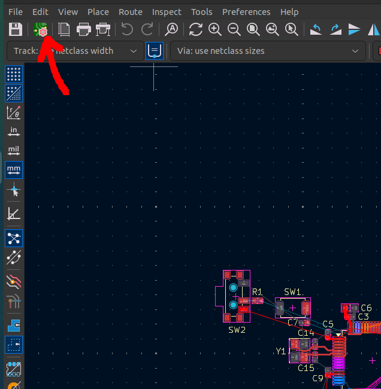
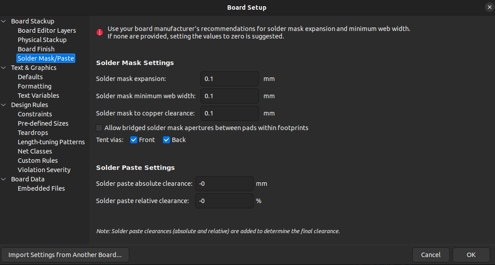
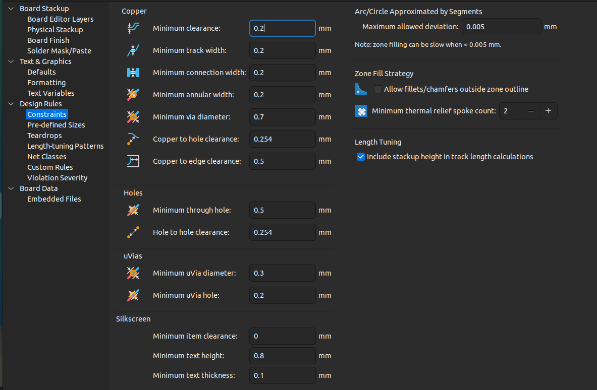
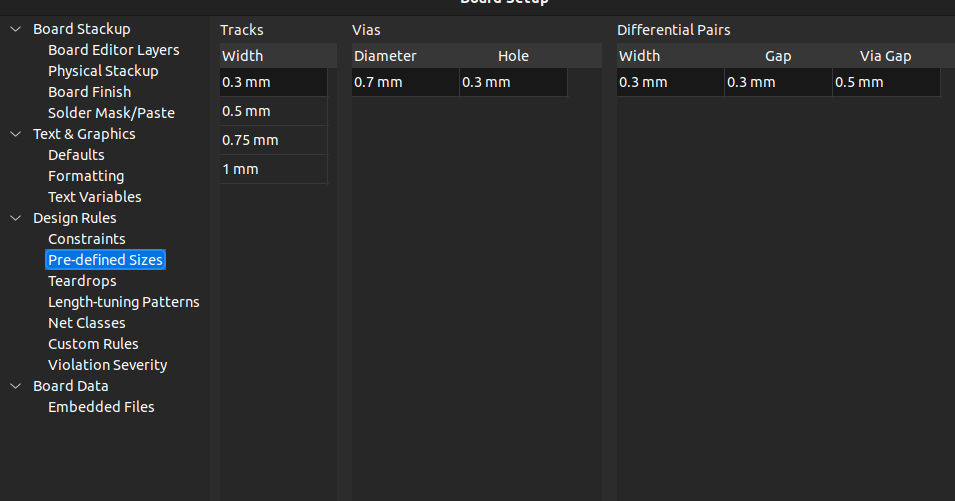
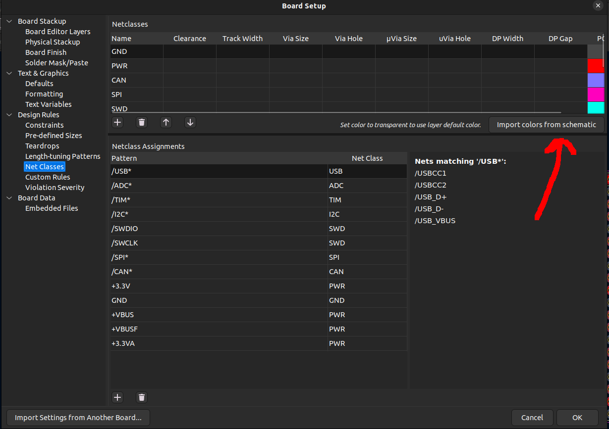
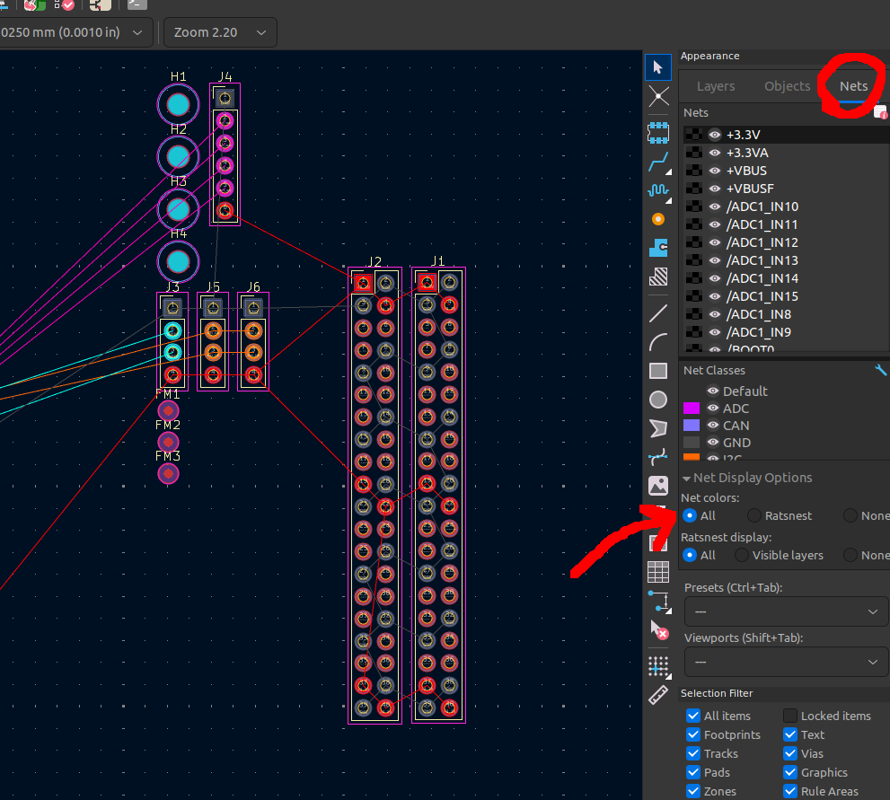

# Guide to Creating your PCB Layout

This guide is for the routing and placement of the actual components!

## Changing Board Settings

### Defining your Stackup

1. Go to the `PCB Editor` and click this button on the top left corner:

2. Then under `Board Stackup`, click `Physical Stackup`. You can change the number of `Copper Layers` at the top left. I leave everything else default

### Telling KiCAD what layers are what

1. Again, go to the `Board Setup` page

2. Under `Board Stackup`, click `Board Editor Layers` and edit what each copper layer do

- Remember, each signal plane must be coupled by a neighboring ground plane. 

- For 2 Layer boards, it's just
    1. Signal
    2. Power Plane (Ground)

- For 4 Layer boards, I like
    1. Signal
    2. Power Plane (Ground)
    3. Power Plane (Ground)
    4. Power Plane (Positive, like +3.3V, but it can have some parts cut out for signal traces)

### Entering Manufactuer Recommendations

0. Go to the `Board Setup` page

#### Edit Solder Mask/Paste Settings

1. Under `Board Stackup` click `Solder Mask/Paste`

2. Use these values:

#### Edit Design Rules Constraints

1. Under `Design Rules` click `Constraints`

2. Use these values:

#### Edit Predefined Sizes

1. Under `Design Rules` click `Pre-defined Sizes`

2. Use these values:

### Coloring Netclasses

1. Under `Design Rules` click `Net Classes`

2. Under the top `Netclasses` section, on the left click `Import color from schematic`

3. Click `OK`

4. In the main screen of `PCB Editor`, go to the very left and click `Nets`, and then under `Net Colors` click `All`

