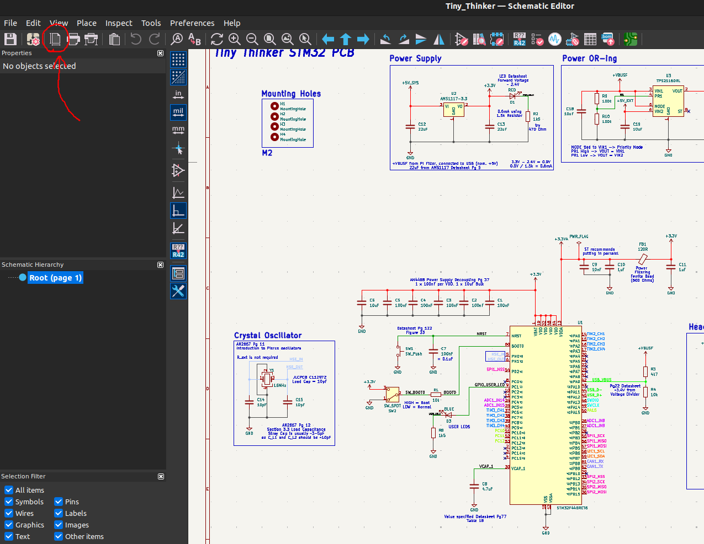
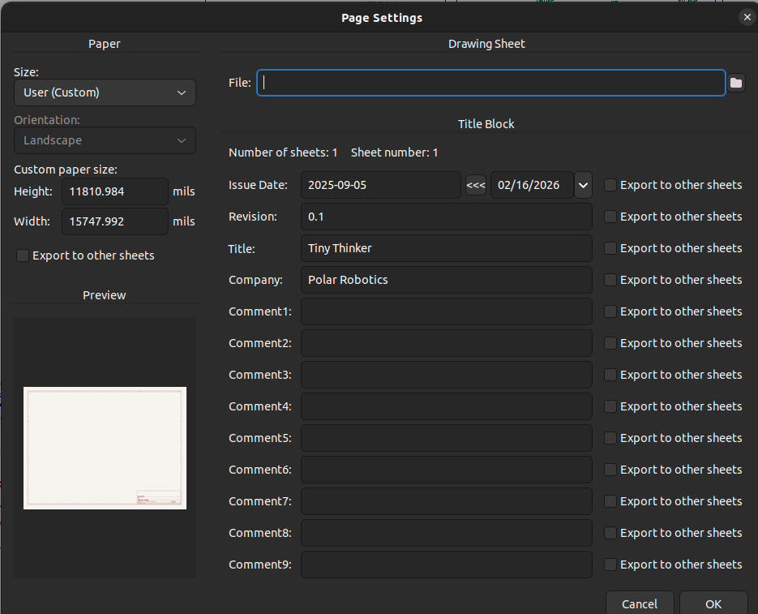
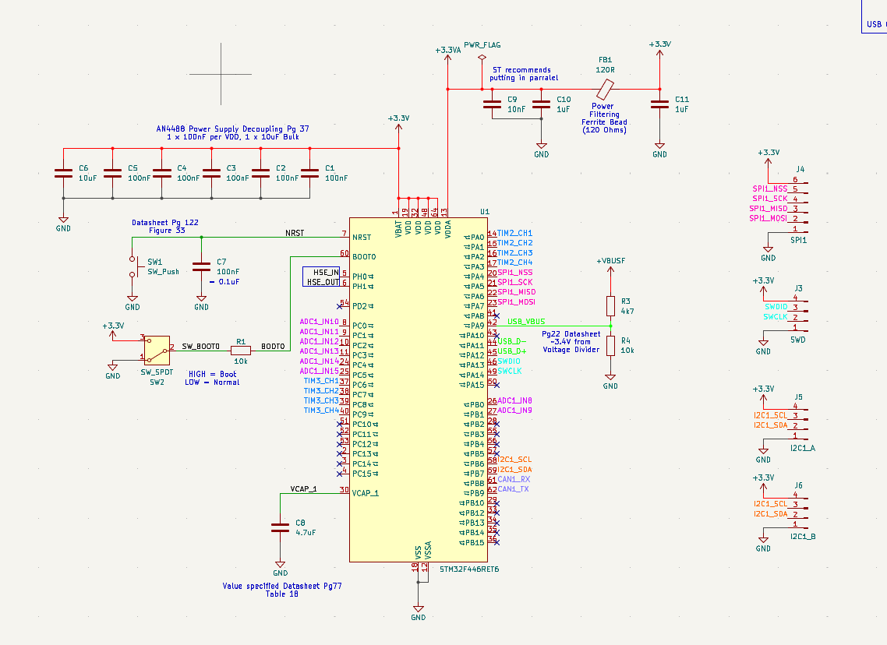
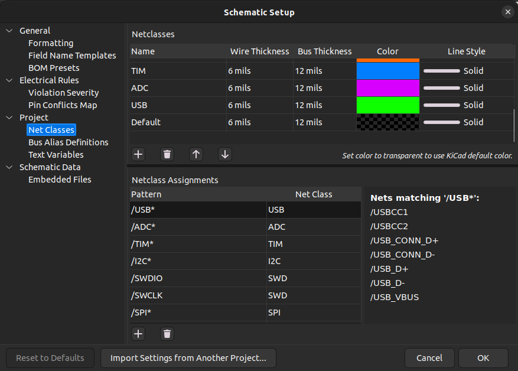

# Guide to Creating Schematics

This should be your first step (other than planning) for creating a PCB!

## Document your Schematic
- Open the `Schematic Editor`

- Top Left, Click `File`
- Click `Page Settings...`
- Fill in the rest!

Click on this button

And Fill in these properties

## Coloring Netclasses

This section is how to color netclasses to look something like this!

1. Click this button on the top left: 

2. Then under `Project` go to `Net Classes`

3. In The top part in `Netclasses`, click the `+` sign and define that netclass you want to color. You can just fill in the `Wire Thickness` and `Bus Thickness` to the default. 

4. Choose a color!

5. At the bottom, under `Netclass Assignments`, define which `Netlabels` you want to apply this to. For all `Netlabels` starting with a certain word, do `/MyNetLabel*`

- **EXAMPLE** I have netlabels labeled as:
    - `ADC1_IN1`
    - `ADC1_IN2`
    - `ADC1_IN2`
- To label all of these, put `/ADC1*`, since all of them start with `ADC1`

6. Then select which Net class (the color pretty much) you want to use

7. For standard netclasses, like `GND` or `+3.3V`, just put them directly, no `/` or `*`, so `GND` or `+3.3V`

8. Click `OK` and there you go!